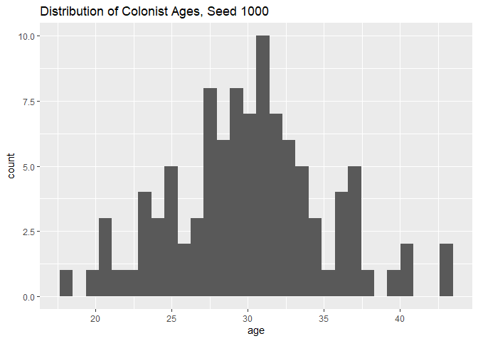
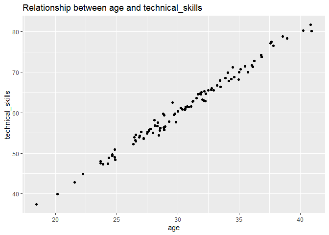

Lab 12 - Colonizing Mars
================
Eric Stone
6.4.24

### Load packages and data

``` r
if (!require("ggplot2")) install.packages("ggplot2")
library(ggplot2)
if (!require("MASS")) install.packages("MASS")
library(MASS)
if (!require("tidyverse")) install.packages("tidyverse")
library(tidyverse)
```

I’m not certain why we’re doing it this way, rather than just loading
the packages. Let’s discuss this when we meet.

### Exercise 1.1

> 1.Create a dataframe to store your colonists’ attributes. I’ve already
> gotten you started, but you’ll need to add their ages.

``` r
set.seed(123)
```

``` r
df_colonists <- data.frame(id = 1:100, age = rnorm(100, mean = 30, sd = 5))
```

> Now, let’s visualize the age distribution of our colonists using a
> histogram. This will help us understand the diversity within our
> potential Mars colony.

``` r
ggplot(data = df_colonists, mapping = aes(x = age)) +
  geom_histogram() +
  labs(title = "Distribution of Colonist Ages")
```

<!-- -->

Most of the ages are between 20 and 40, as would be expected by the mean
and sd’s, but there are some over 40 and under 20.

### Exercise 1.2

> Consider the histograms of the age distribution that we’ve generated
> (as well as two more I added). What do you notice about the age
> distribution of our colonists? How does the seed affect the spread of
> the distribution?

I think the idea here is to see how the shape looks with different
seeds. So I redid this, with different seeds.

``` r
set.seed(100)
df_colonists_seed100 <- data.frame(id = 1:100, age = rnorm(100, mean = 30, sd = 5))
ggplot(data = df_colonists, mapping = aes(x = age)) +
  geom_histogram() +
  labs(title = "Distribution of Colonist Ages, Seed 100")
```

<!-- -->

``` r
set.seed(1000)
df_colonists_seed1000 <- data.frame(id = 1:100, age = rnorm(100, mean = 30, sd = 5))
ggplot(data = df_colonists, mapping = aes(x = age)) +
  geom_histogram() +
  labs(title = "Distribution of Colonist Ages, Seed 1000")
```

<!-- -->

The distributions are slightly different, as would be expected.

Note in what you (Mason) showed, they were on the same graph. I’m not
seeing how you did that. That would be a good thing to discuss too.

> What roles would these colonists have? Let’s decide….. We need
> engineers, scientists, and medics in equal numbers. We’ll create a
> variable, role, with three categories: engineer, scientist, and medic.
> We’ll use the rep() function to simulate this categorical variable.
> I’ve demonstrated several ways you can use rep() to create the role
> variable. Try them out.

``` r
set.seed(1)
df_colonists_roles <- data.frame(id = 1:100, age = rnorm(100, mean = 30, sd = 5), role1 = rep(c("engineer", "scientist", "medic"), length.out = 100), role2 = rep(c("engineer", "scientist", "medic"), each = 34, length.out = 100), role3 = rep(c("engineer", "scientist", "medic"), times = c(33, 33, 33), length.out = 100), role4 = sample(c("engineer", "scientist", "medic"), replace = TRUE, size = 100, prob = c(1,1,1)) ) 
df_colonists_roles %>%
  pivot_longer(cols = starts_with("role"), names_to = "role_type", values_to = "role") %>%
  count(role_type, role)
```

    ## # A tibble: 12 × 3
    ##    role_type role          n
    ##    <chr>     <chr>     <int>
    ##  1 role1     engineer     34
    ##  2 role1     medic        33
    ##  3 role1     scientist    33
    ##  4 role2     engineer     34
    ##  5 role2     medic        32
    ##  6 role2     scientist    34
    ##  7 role3     engineer     34
    ##  8 role3     medic        33
    ##  9 role3     scientist    33
    ## 10 role4     engineer     24
    ## 11 role4     medic        31
    ## 12 role4     scientist    45

(yes, I got some help from chat for the pivot_longer command, which I
don’t really understand)

At any rate, here’s what I can surmise:

- Method 1 and Method 3 seem to be the same. (I tried this with multiple
  seeds, and it always produced the exact same results.) In both cases,
  ID 1 was an engineer, ID 2 a scientist, ID 3 a medic, ID 4 an
  engineer, etc.
- Method 2 gave 34 engineers and scientists (the first two professions
  listed), and then tried to get 34 medics, but there were only 32
  people left so there are only 32 medics.
- Method 4 appears to choose probabilistically (e.g., ID 1 has a 1/3
  chance of being an engineer, scientist, or medic; same with ID 2,
  etc). This in one sense is the best approach, but likely in practice
  we’ll have substantial deviation from equality just by chance, as
  happened here.

> 1.3. Create a role variable that suites the needs of your colony, and
> explain why you chose that method.

Note to Mason: ‘suits’ rather than ‘suites’ :)

Honestly, I don’t really like any of the methods. Method 4 produces
unequal n’s. Method 1&3 are the closest to unequal n’s, but I have two
problems with this approach:

1)  Which profession has 34 isn’t random

2)  More importantly, which ID’s get which professions isn’t random.
    Because age was random, I don’t think that’s a problem here. But
    let’s say that we assigned age categorically, via age =
    rep(c(“young”, “mature”, “old”), length.out = 100). Now, EVERY
    engineer is young, every medic is old, etc. This seems like a major
    problem.

This issue could perhaps be solved with block randomization rather than
using the same order for each block of 3, but what I’d like would be to
just randomly assign 33 of the IDs to engineer, 33 to scientist, and 33
to medic. This has to be doable, right???

Given the options, I think I have to go with Method 4, but I’m not crazy
about it because I wanted more of a uniform (identical) distribution of
each of the roles.

``` r
set.seed(123)
```

``` r
df_colonists <- df_colonists %>% mutate (role = sample(c("engineer", "scientist", "medic"), replace = TRUE, size = 100, prob = c(1,1,1)) )
```

> 1.4. Add a uniformally-distributed MARSGAR variable to your colony.

``` r
df_colonists$marsgar <- runif(100,min = 50, max = 100)
```

This seems to have added marsgar to my data frame!!!!!! Yea. I thought I
had to use mutate every time – this is much easier.

Note I started my range at 50 rather than 0 so that my colonists aren’t
dead …..

``` r
ggplot(data = df_colonists, mapping = aes(x = age, y = marsgar)) +
  geom_point() +
  labs(title = "Relationship between age and marsgar")
```

<!-- -->

### Exercise 2

> Simulate technical skills based on age using the equation
> technical_skills = 2 \* age + noise.

``` r
set.seed(1235)
```

We’re changing the seed that we used to create the other variables in
the dataset (from 123 to 1235). I think there’s no particular reason to
do this, but please let me know if that’s wrong!

``` r
df_colonists$technical_skills <- 2 * df_colonists$age + rnorm(100, mean = 0, sd = 1)
```

``` r
ggplot(data = df_colonists, mapping = aes(x = age, y = technical_skills)) +
  geom_point() +
  labs(title = "Relationship between age and technical_skills")
```

<!-- -->

Hmm, I wish technical skills went up that clearly with age, but as the
Mason and Eric data points indicate, this is an unrealistic graph….

> 2.2. Simulate problem-solving abilities based on their assigned role.
> Now its your turn! Simulate problem-solving abilities based on their
> assigned role. Recall that the options are “engineer”, “scientist”,
> “medic”. First you need to think about the relationship between the
> role AND the variable being simulated. Then you can write up the
> equation that would create that relationship. And then you can write
> the code to simulate the variable.

I’m going to assume problem solving ranges from 0 to 100. I’m going to
make the following other assumptions:

1)  The rank ordering of problem solving ability is (from best to
    worst): engineer, scientist, medic
2)  However, the three professions are very similar in problem solving
    ability, and there is substantial overlap among the distributions
3)  In general, the problem solving ability is quite high

I’ll make the means 74, 75, and 76, and with a constant sd of 6. In
actuality, the sd should probably be larger, but I don’t want to get a
score greater than 100 and i’m not sure how to deal with that
possibility. There also should probably be some negative skew, but this
should suffice for now.

``` r
df_colonists$problem_solving[df_colonists$role == "engineer"] <- rnorm(sum(df_colonists$role == "engineer"), mean = 76, sd = 6)
df_colonists$problem_solving[df_colonists$role == "scientist"] <- rnorm(sum(df_colonists$role == "scientist"), mean = 75, sd = 6)
df_colonists$problem_solving[df_colonists$role == "medic"] <- rnorm(sum(df_colonists$role == "medic"), mean = 74, sd = 6)
```

This is as far as I got. This code worked (I think), but I don’t
understand why. In particular, why is the sum command there?

I Also want to get means and sd’s per group as a check.
